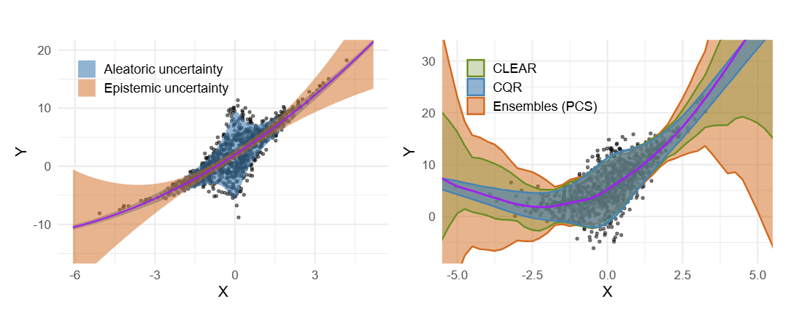

# CLEAR: Calibrated Learning for Epistemic and Aleatoric Risk

Ilia Azizi<sup>1*</sup>, Juraj Bodik<sup>1,2*</sup>, Jakob Heiss<sup>2*</sup>, Bin Yu<sup>2,3</sup>

<sup>1</sup>Department of Operations, HEC, University of Lausanne, Switzerland
<sup>2</sup>Department of Statistics, University of California, Berkeley, USA
<sup>3</sup>Department of Electrical Engineering and Computer Sciences, University of California, Berkeley, USA
<sup>*</sup>Equal contribution

**Abstract**: Accurate uncertainty quantification is critical for reliable predictive modeling, especially in regression tasks. Existing methods typically address either aleatoric uncertainty from measurement noise or epistemic uncertainty from limited data, but not necessarily both in a balanced way. We propose CLEAR, a calibration process with two distinct parameters, $\gamma_1$ and $\gamma_2$, to combine the two uncertainty components for improved conditional coverage. CLEAR is compatible with any pair of aleatoric and epistemic estimators; we show how it can be used with (i) quantile regression for aleatoric uncertainty and (ii) ensembles drawn from the Predictability–Computability–Stability (PCS) framework for epistemic uncertainty. Across 17 diverse real-world datasets, CLEAR achieves an average improvement of 28.2\% and 17.4\% in the interval width compared to the two individually calibrated baselines while maintaining nominal coverage. This improvement can be particularly evident in scenarios dominated by either high epistemic or high aleatoric uncertainty.



## Requirements

1.  Ensure Python 3.11 is installed on your system.

2.  Create and activate a virtual environment using Conda. It is recommended to use the provided `requirements.txt` file which lists all packages used in the development environment:
    ```bash
    conda create --name clear python=3.11 --yes
    conda activate clear
    ```
    *Note*: In case of any issues with tkinter (when running `pytest` for `test_utils.py`), use the following command `conda install -c conda-forge tk tcl --yes` to install tkinter.

3.  Install the dependencies using pip into your active Conda environment:
    ```bash
    pip install -r requirements.txt
    ```
    *Note: The `requirements.txt` file was generated from the experiment's environment, and some of the packages, such as `catboot` and `lightgbm`, were only included since they were in the original baseline code bases (i.e., `PCS_UQ` and `UACQR`). The `celer` pip conflict warning is normal (package needed only for `PCS_UQ` mean models). Additionally, note that `pygam` (which is not updated frequently) conflicts with the current (and latest) version of `scipy` and `numpy`. CLEAR works perfectly fine with the latest versions of some of the packages, however, the baselines may have compatibility issues with packages (e.g. `numpy==2.0.0` or `quantile_forest==1.4.0` for `UACQR`). We try to find maximum compatibility, but if you run into issues, please let us know.*

4.  Finally, to run the tests and make sure everything is working, execute the following command from the root directory of the repository:
    ```bash
    pytest
    ```

## Demo

For a high-level overview of the CLEAR pipeline and a practical demonstration of its usage, please refer to [`demo.py`](demo.py) (script) and [`demo.ipynb`](demo.ipynb) (Jupyter Notebook), available at the root of this repository. The demo provides a guided walkthrough by applying CLEAR to synthetic, Parkinsons, and Airfoil datasets. Note that for simplicity, we have used internal training for CQR, but you can also use external training (predictions) for the CQR model. There's also some instructions for running the demo in Google Colab.

Minimal example:

```python
import numpy as np
from sklearn.datasets import make_regression
from sklearn.model_selection import train_test_split
from src.clear.clear import CLEAR

# 0. Generate Data (Minimal Example)
X, y = make_regression(n_samples=200, n_features=1, noise=10, random_state=42)
X_train, X_temp, y_train, y_temp = train_test_split(X, y, test_size=0.5, random_state=42)
X_calib, X_test, y_calib, y_test_actual = train_test_split(X_temp, y_temp, test_size=0.5, random_state=42)

# Some given external epistemic predictions
val_ep_median = X_calib[:,0] * np.mean(y_train/X_train[:,0])
val_ep_lower  = val_ep_median - 2 
val_ep_upper  = val_ep_median + 2

test_ep_median = X_test[:,0] * np.mean(y_train/X_train[:,0])
test_ep_lower  = test_ep_median - 2
test_ep_upper  = test_ep_median + 2

# 1. Initialize CLEAR
clear_model = CLEAR(desired_coverage=0.95, n_bootstraps=10, random_state=777)

# 2. Fit CLEAR's Aleatoric Component (same can also be done internally for the epistemic model)
clear_model.fit_aleatoric(
    X=X_train, 
    y=y_train, 
    quantile_model='qrf',
    fit_on_residuals=True, 
    epistemic_preds= (X_train[:,0] * np.mean(y_train/X_train[:,0])))

# 3. Get Aleatoric Predictions for Calibration Set
al_median_calib, al_lower_calib, al_upper_calib = clear_model.predict_aleatoric(X=X_calib, epistemic_preds=val_ep_median)

# 4. Calibrate CLEAR
clear_model.calibrate(
    y_calib=y_calib,
    median_epistemic=val_ep_median,
    aleatoric_median=al_median_calib, 
    aleatoric_lower=al_lower_calib, 
    aleatoric_upper=al_upper_calib,
    epistemic_lower=val_ep_lower, 
    epistemic_upper=val_ep_upper
)
print(f"Optimal Lambda: {clear_model.optimal_lambda:.3f}, Gamma: {clear_model.gamma:.3f}")

# 5. Predict with Calibrated CLEAR
clear_lower, clear_upper = clear_model.predict(
    X=X_test,
    external_epistemic={ 'median': test_ep_median, 'lower': test_ep_lower, 'upper': test_ep_upper }
)

print(f"Test CLEAR intervals (first 3): Lower={clear_lower[:3].round(2)}, Upper={clear_upper[:3].round(2)}")
```

## Repo Structure

Below is a high-level overview of the important directories and files in this project:

```bash
├── data/                            # Contains all datasets used for experiments and case studies.
├── models/                          # Stores pre-trained models and outputs from model training runs.
├── PCS_UQ/                          # Codebase and experiments for the PCS-UQ framework (referenced in paper).
├── UACQR/                           # Codebase and experiments for the UACQR method (referenced in paper).
├── plots/                           # Directory for storing plots generated from experiment results.
│   ├── real/                        # Plots related to experiments on real-world datasets.
│   └── simulations/                 # Plots related to experiments on simulated datasets.
├── results/                         # Stores raw and aggregated results from various experiments.
│   ├── case_study/                  # Results specific to the Ames housing case study.
│   ├── qPCS_all_10seeds_all/        # Variant (a) against the baselines.
│   ├── qPCS_qxgb_10seeds_qxgb/      # Variant (b) against the baselines.
│   └── PCS_all_10seeds_qrf/         # Variant (c) against the baselines.
├── src/                             # Main source code for the CLEAR.
│   ├── case_study/                  # Code for the Ames housing case study, including data preparation and analysis.
│   ├── clear/                       # Core implementation of the CLEAR algorithm and associated utilities.
│   │   ├── clear.py                 # Implements the main CLEAR calibration logic.
│   │   ├── metrics.py               # Defines metrics for evaluating prediction intervals.
│   │   ├── models.py                # Provides additional (untested) quantile regressor NOT currently used in the paper and has only been included for future extension (UNTESTED).
│   │   └── utils.py                 # Contains utility functions used across the CLEAR module.
│   ├── experiments/                 # Scripts to run download/process data, run benchmarks, and manage experiments.
│   │   ├── download_process_real_data.py # Downloads and preprocesses real-world datasets (has already been prvoided in the data/ directory).
│   │   ├── benchmark_real_data.py     # Runs benchmark experiments on real-world datasets.
│   │   ├── benchmark_uacqr.py         # Runs benchmark experiments for the UACQR method.
│   │   ├── benchmark_simulations.py   # Runs benchmark experiments on simulated datasets.
│   │   └── utils.py                   # Utility functions for experiment scripts.
│   ├── pcs/                         # Utility scripts related to training and using PCS models that are used in the experiments as well.
│   └── tests/                       # Contains tests for the project's codebase.
├── demo.py                          # A demonstration script showcasing the CLEAR methodology.
├── demo.ipynb                       # A Jupyter Notebook demonstration of the CLEAR methodology (generated from demo.py).
├── README.md                        # This file: Project overview, setup instructions, and repository structure.
├── pytest.ini                       # Configuration file for pytest.
├── requirements.txt                 # Lists Python packages and versions required to run the project.
└── .gitignore                       # Specifies intentionally untracked files that Git should ignore.

```

## Reproducibility

To reproduce the experiments presented in this work, follow these general steps after setting up the environment as described in the "Requirements" section:

1.  **Download and Prepare Data:**
    *   The necessary datasets are expected to be in the `data/` directory. All of them are already provided.
    *   For any datasets that might need specific preprocessing or were originally downloaded via script, you can inspect `src/experiments/download_process_real_data.py`. However, for our experiments, the data in `data/` should be ready.

        ```bash
        cd src/experiments
        python download_process_real_data.py
        ```

2.  **Run Benchmark Experiments:**
    *   The core scripts for running experiments are located in the `src/experiments/` directory.
    *   *Optional:* We provide the trained PCS ensemble models in [one of the sections below](#Models), however, you can also retrain the PCS quantile and mean predictor models in `src/pcs/` using the `train_pcs_quantile.py` and `train_pcs_mean.py` scripts.
        ```bash
        cd src/pcs
        python train_pcs_quantile.py
        python train_pcs_mean.py
        ```
    *   To run benchmarks on real-world datasets, navigate to `src/experiments/` and execute: `python benchmark_real_data.py`
        ```bash
        cd src/experiments
        # To run the experiments with real-data variants (a)
        python benchmark_real_data.py --coverage 0.95 --generate_tables --n_jobs 25 --global_log --approach both --models_dir ../../models/pcs_top1_qpcs_10 --csv_results_dir ../../results/qPCS_all_10seeds_all
        
        # To run the experiments with real-data variants (b)
        python benchmark_real_data.py --coverage 0.95 --generate_tables --n_jobs 30 --global_log --approach both --models_dir ../../models/pcs_top1_qxgb_10 --csv_results_dir ../../results/qPCS_qxgb_10seeds_qxgb
        
        # To run the experiments with real-data variants (c)
        python benchmark_real_data.py --coverage 0.95 --generate_tables --n_jobs 30 --global_log --approach both --models_dir ../../models/pcs_top1_mean_10 --csv_results_dir ../../results/PCS_all_10seeds_qrf
        ```

        **Note:** Note that the GAM in variant (a) may not converge for `data_naval_propulsion`. This has been documented in the paper as a footnote and it's a bug related to the `pygam` package: https://github.com/dswah/pyGAM/issues/357

    *   To run benchmarks on simulated datasets, navigate to `src/experiments/` and execute: `python benchmark_simulations.py`
        ```bash
        cd src/experiments
        # Homoscedastic noise with sigma=1, d=1, 100 simulations
        python benchmark_simulations.py --d 1 --num_simulations 100 --noise_type homo --use_external_pcs

        # Heteroscedastic noise with sigma=1+|x|, d=1, 100 simulations
        python benchmark_simulations.py --d 1 --num_simulations 100 --noise_type hetero1 --use_external_pcs

        # Heteroscedastic noise with sigma=1+1/(1+x^2), d=1, 100 simulations
        python benchmark_simulations.py --d 1 --num_simulations 100 --noise_type hetero2 --use_external_pcs

        # Multivariate: Homoscedastic noise with sigma=1, d=1, 100 simulations, no external PCS
        python benchmark_simulations.py --randomize_d --num_simulations 100 --noise_type homo --use_external_pcs
        ```
    
    *   To run benchmarks specifically for the UACQR comparison, navigate to `src/experiments/` and execute: `python benchmark_uacqr.py`
        ```bash
        cd src/experiments
        python benchmark_uacqr.py
        ```
    *   Consult the respective scripts for any command-line arguments or configurations you might want to adjust (e.g., specific datasets, model parameters, number of seeds) that can be found in the scripts. As seen above, most scripts support `argparse` to adjust parameters.

3.  **Results:**
    *   Raw and aggregated results will typically be saved in the `results/` directory.
    *   Plots based on these results are often generated and stored in the `plots/` directory.

4.  **Case Study:**
    *   The Ames housing case study can be run by navigating to `src/case_study/` and using the script: `python ames_clear_case_study.py`

        ```bash
        python ames_clear_case_study.py
        ```


The experiments were conducted on a machine with the following specifications:

```
- Operating System: Microsoft Windows 11 Home, Version 10.0.22631
- Processor: 13th Gen Intel(R) Core(TM) i9-13900KF
- RAM: 32 GB
- GPU: NVIDIA GeForce RTX 4090
- CUDA Version: 12.1 worked system-wide, and 11.2 worked with conda
- Python & Dependencies: As described above and listed in requirements.txt
```
Please note that you do not need a GPU to run the experiments, however, it is recommended to use parallelization with 20+ threads (jobs) to speed up the experiments.

<!-- *Checking if CUDA is available:*
```bash
python -c "import torch; print(f'GPU Available: {torch.cuda.is_available()}'); print(f'GPU Name: {torch.cuda.get_device_name(0) if torch.cuda.is_available() else None}')"
``` -->

## Models

The models can be retrieved from the [following google-drive link](https://drive.google.com/drive/folders/1e7intOLu7DzoMLMdfRH8weA74QpO6hsf?usp=sharing), and all the content (including the subfolders such as `pcs_top1_qpcs_10`, `pcs_top1_qxgb_10`, `pcs_top1_mean_10`) must be placed in the `models/` directory. We also included a `models/demo` folder, which is just a copy of the `data_parkinsons_pcs_results_95` from `pcs_top1_qpcs_10` for running the demo. Additionally, the `models/README.md` is attributed to the files in the google drive link.

### Model Training & Calibration Time

Below, we also provide the average training time for each of the variants on a given real-world dataset computed on the machine mentioned above. The times are provided in seconds *(s)* and have been averaged over 10 seeds. For CLEAR, the only required computation is the calibration time (computation of $\lambda$ and $\gamma_1$). Note that in our experiments and results, we provide many other models (e.g., CQR, CQR-R, ALEATORIC-R/CQR-R+, $\lambda=1$, $\gamma_1=1$, etc.) for comparison purposes; only the times for the methods included in the paper are provided below. The experiments were run exactly as described in the paper (particularly for the 100 bootstraps).

#### Variant (a)

<div align="center">

| Dataset | PCS (s) | ALEATORIC-R (s) | CLEAR (s) | Total (s) |
|---|---|---|---|---|
| ailerons | 13.46 | 6.80 | 0.27 | 20.53 |
| airfoil | 3.10 | 1.92 | 0.17 | 5.19 |
| allstate | 1124.47 | 22.93 | 0.19 | 1147.59 |
| ca_housing | 8.51 | 7.79 | 0.54 | 16.84 |
| computer | 61.92 | 76.09 | 0.16 | 138.16 |
| concrete | 1.10 | 2.16 | 0.17 | 3.43 |
| elevator | 18.79 | 122.16 | 0.60 | 141.54 |
| energy_efficiency | 0.81 | 1.65 | 0.16 | 2.62 |
| insurance | 3.48 | 17.23 | 0.11 | 20.82 |
| kin8nm | 3.25 | 5.43 | 0.21 | 8.89 |
| miami_housing | 7.31 | 7.66 | 0.72 | 15.68 |
| naval_propulsion | 19.83 | 81.32 | 0.29 | 101.44 |
| parkinsons | 39.53 | 60.99 | 0.14 | 100.66 |
| powerplant | 3.08 | 4.92 | 0.21 | 8.22 |
| qsar | 348.59 | 10.00 | 0.20 | 358.78 |
| sulfur | 21.55 | 16.56 | 0.21 | 38.32 |
| superconductor | 561.84 | 795.45 | 12.70 | 1369.99 |
| **Total** | **2240.60** | **1241.06** | **17.06** | **3498.71** |

</div>

#### Variant (b)

<div align="center">

| Dataset | PCS (s) | ALEATORIC-R (s) | CLEAR (s) | Total (s) |
|---|---|---|---|---|
| ailerons | 4.51 | 6.89 | 0.26 | 11.66 |
| airfoil | 0.78 | 1.64 | 0.16 | 2.59 |
| allstate | 27.73 | 14.22 | 0.20 | 42.15 |
| ca_housing | 5.42 | 7.69 | 0.39 | 13.50 |
| computer | 3.46 | 5.97 | 0.21 | 9.65 |
| concrete | 0.86 | 1.82 | 0.17 | 2.85 |
| elevator | 4.43 | 6.71 | 0.79 | 11.93 |
| energy_efficiency | 0.68 | 1.40 | 0.17 | 2.25 |
| insurance | 0.80 | 1.65 | 0.17 | 2.62 |
| kin8nm | 2.61 | 4.96 | 0.21 | 7.78 |
| miami_housing | 4.61 | 7.70 | 0.70 | 13.01 |
| naval_propulsion | 3.72 | 6.38 | 0.55 | 10.64 |
| parkinsons | 2.71 | 5.37 | 0.20 | 8.28 |
| powerplant | 2.73 | 4.32 | 0.22 | 7.26 |
| qsar | 5.00 | 9.67 | 0.20 | 14.86 |
| sulfur | 2.89 | 4.64 | 0.23 | 7.76 |
| superconductor | 13.81 | 22.74 | 1.00 | 37.55 |
| **Total** | **86.77** | **113.76** | **5.81** | **206.34** |
</div>

#### Variant (c)

<div align="center">

| Dataset | PCS (s) | ALEATORIC-R (s) | CLEAR (s) | Total (s) |
|---|---|---|---|---|
| ailerons | 10.20 | 104.32 | 0.65 | 115.17 |
| airfoil | 0.88 | 17.82 | 0.11 | 18.81 |
| allstate | 651.02 | 125.77 | 0.14 | 776.93 |
| ca_housing | 3.63 | 130.87 | 4.16 | 138.66 |
| computer | 4.55 | 65.28 | 0.16 | 69.98 |
| concrete | 1.16 | 17.49 | 0.11 | 18.76 |
| elevator | 3.25 | 98.73 | 1.97 | 103.95 |
| energy_efficiency | 0.95 | 15.42 | 0.10 | 16.47 |
| insurance | 0.90 | 19.80 | 0.11 | 20.81 |
| kin8nm | 16.89 | 69.17 | 0.16 | 86.22 |
| miami_housing | 5.34 | 123.32 | 0.92 | 129.58 |
| naval_propulsion | 1.14 | 115.41 | 0.74 | 117.28 |
| parkinsons | 3.71 | 53.43 | 0.14 | 57.27 |
| powerplant | 2.37 | 60.99 | 0.17 | 63.52 |
| qsar | 21.48 | 93.84 | 0.14 | 115.46 |
| sulfur | 2.43 | 67.41 | 0.17 | 70.01 |
| superconductor | 60.63 | 644.13 | 8.10 | 712.86 |
| **Total** | **790.52** | **1823.18** | **18.05** | **2631.75** |
</div>


## Data

The project utilizes 18 diverse real-world regression datasets (17 for the benchmarks and 1 for the case study). All processed datasets are provided in the `data/` directory. The script `src/experiments/download_process_real_data.py` (adapted from the original PCS-UQ paper's data processing notebook) was used to download and process these datasets.

Each dataset is stored in its own subdirectory within `data/` (e.g., `data/data_ailerons/`) and typically includes the following files:

*   `X.csv`: The feature matrix (processed, with one-hot encoding for categorical features).
*   `y.csv`: The target variable vector.
*   `importances.csv`: Feature importances as determined by a Random Forest model during preprocessing.
*   `bin_df.pkl`: A pickled Pandas DataFrame containing binned versions of features, used for subgroup analysis.

The datasets included are:

<div align="center">

| Dataset           |     n |    d |
|:------------------|------:|-----:|
| ailerons          | 13750 |   40 |
| airfoil           |  1503 |    5 |
| allstate          |  5000 | 1037 |
| ca housing        | 20640 |    8 |
| computer          |  8192 |   21 |
| concrete          |  1030 |    8 |
| diamond           | 53940 |   23 |
| elevator          | 16599 |   18 |
| energy efficiency |   768 |   10 |
| insurance         |  1338 |    8 |
| kin8nm            |  8192 |    8 |
| miami housing     | 13932 |   28 |
| naval propulsion  | 11934 |   24 |
| parkinsons        |  5875 |   18 |
| powerplant        |  9568 |    4 |
| qsar              |  5742 |  500 |
| sulfur            | 10081 |    5 |
| superconductor    | 21263 |   79 |

</div>

For details on the original sources and specific preprocessing steps for each dataset, please refer to the comments and documentation within `src/experiments/download_process_real_data.py`.

